# Engineering_4_Notebook

## Table of Contents

* [Python_Calculator](#Python_Calculator)
* [Python_Quadratic_Solver](#Python_Quadratic_Solver)
* [Python_Strings_and_Loops](#Python_Strings_and_Loops)
* [Python_MSP](#Python_MSP) (Hangman)
* [Python_Sudoku_Solver](#Python_Sudoku_Solver)
* [Onshape_CAD_Intro](#Onshape_CAD_Intro)
* [Onshape_Legos](#Onshape_Legos)
* [Raspberry_Pi_LED_Blink](#)
---


## Python_Calculator

### Assignment Description

In this assignment, I made a function that allows you to do addition, subtraction, multiplication, division, and remainder division. It takes three values as parameters, two numbers to do the operations with and a third value that determines which operation will be done on the other values. The spicy version added the ability to do factorials, which returns a list that includes the factorials of both numbers instead of just one number like the other operations.

### Evidence 

<details><summary><b>Vanilla Version</b></summary><br/>

[Calculator Vanilla Version Code](https://github.com/adent11/Engineering_4_Notebook/blob/main/Python/calculator.py)<br/><br/>
Program Output:<br/>
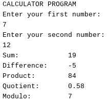 <br/>
<br/></details>

<details><summary><b>Spicy Version</b></summary><br/>
 
[Calculator Spicy Version Code](https://github.com/adent11/Engineering_4_Notebook/blob/main/Python/calculator_spicy.py)<br/><br/>
Program Output:<br/>
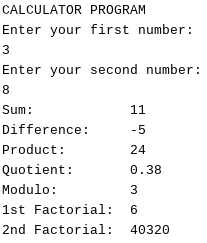 <br/>
<br/></details>

### Reflection

This assignment was relatively simple, but still had many valuable lessons. Since it has been a while since I have coded in Python, reference websites like <https://www.w3schools.com/python> are very helpful for remembering syntax and giving simple descriptions and examples of how different parts of Python work. I also learned that you can return a list from a function and access the different items using ``` functionName(parameters)[itemNumber] ```.

 
## Python_Quadratic_Solver

### Assignment Description

In this assignment, I wrote a program that takes a, b, and c, of a quadratic equation in the form y = ax^2+bx+c, and returns the roots of the function, or a message stating that they don't exist if they are imaginary. I divided each of these tasks into different functions, one to calculate and return the discriminant, which tells you if there are real roots, another to find and return the roots. It then asks for a new set of a, b, and c, or for the user to end the program. For the spicy version, I made it print out the equation with the inputted a, b, and c plugged in, and added another function which puts the equation in vertex form.
 
### Evidence

<details><summary><b>Vanilla Version</b></summary><br/>

[Quadratic Solver Vanilla Version Code](https://github.com/adent11/Engineering_4_Notebook/blob/main/Python/quadratic_solver.py)<br/><br/>
Program Output:<br/>
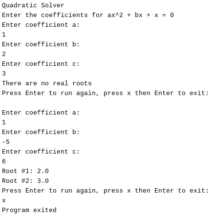 <br/>
<br/></details>
 
<details><summary><b>Spicy Version</b></summary><br/>

[Quadratic Solver Spicy Version Code](https://github.com/adent11/Engineering_4_Notebook/blob/main/Python/quadratic_solver_spicy.py)<br/><br/>
Program Output:<br/>
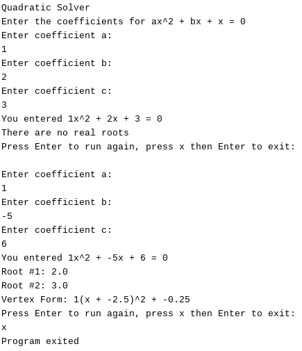 <br/>
<br/></details>
 
### Reflection

This assignment taught me the syntax for squaring things in Python, ``` a ** x ```, as well as how to import and use the square root function, ``` from math import sqrt ``` and ``` sqrt(x) ```. I also learned how to use f strings to be able to put variables inside of strings more easily, <br/> ``` f" This is {variableA} and {variableB}" ```.

 
## Python_Strings_and_Loops

### Assignment Description

In this assignment, I wrote a program that takes a sentence input by the user and prints out each character on a new line, with a - after each word. For the spicy version, I condensed the whole program into one line of code, while retaining the same functionality.

### Evidence
 
<details><summary><b>Vanilla Version</b></summary><br/>

[Strings and Loops Vanilla Version Code](https://github.com/adent11/Engineering_4_Notebook/blob/main/Python/strings_and_loops.py)<br/><br/>
Program Output:<br/>
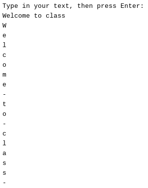 <br/>
<br/></details>
 
<details><summary><b>Spicy Version</b></summary><br/>

[Strings and Loops Spicy Version Code](https://github.com/adent11/Engineering_4_Notebook/blob/main/Python/strings_and_loops_spicy.py)<br/><br/>
Program Output:<br/>
 <br/>
<br/></details>
 
### Reflection

In this assignment I learned a few things, but didn't run in to any major obstacles. While doing the vanilla version, I learned that in Python, you can use ```list(string)``` to create a list with each character in the string as its own element and ```string.split()``` to create a list of each substring in the string between a certain character, which defaults to a space. In the spicy version, I learned a new string method (you can replace every instance of a certain character in a string with another character using ```string.replace(oldCharacter, newCharacter)```), but my main takeaway that Python for loop syntax can be very strange; you can put a print statement on the same line before the for statement it is printing the value of, but only if you have brackets around it. (I think, at least, although I have no idea why this syntax would be used)
 
 ## Python_MSP
 
 ### Assignment Description
 In this assignment, the goal was to create a hangman game. One user enters the word, then another guesses letter until they have either guessed all letters correctly or they run out of lives. For each correct guess, that letter is added to the guess, while for each incorrect guess, a body part is added to the hangman and a life is subtracted. For the spicy version, I added a list of incorrect guesses, exceptions for if the letter entered had already been guessed or was not a single, lower case letter, a hint system, and a counter for correct guesses, incorrect guesses, and hints used.
 
 
 ### Evidence
 
 <details><summary><b>Vanilla Version</b></summary><br/>

[Hangman Vanilla Version Code](https://github.com/adent11/Engineering_4_Notebook/blob/main/Python/hangman.py)<br/><br/>
Program Output:<br/>
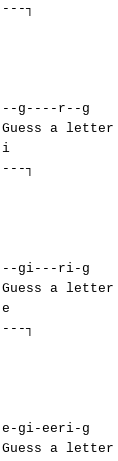 <br/>
<br/></details>
 
<details><summary><b>Spicy Version</b></summary><br/>

[Hangman Spicy Version Code](https://github.com/adent11/Engineering_4_Notebook/blob/main/Python/hangman_spicy.py)<br/><br/>
Program Output:<br/>
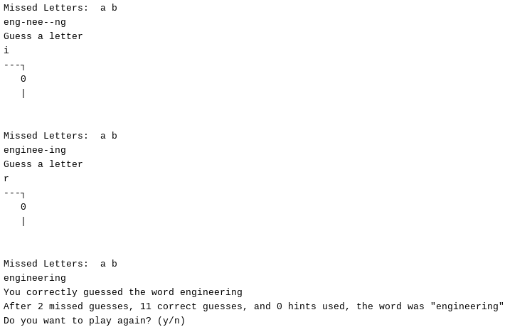 <br/>
<br/></details>
 
 ### Reflection
None of the logic in this assignment was too challenging, but I did learn some things about string manipulation. To replace a certain character at certain place in a string, you can use ```string = string[:index] + characterReplacement + string[index+1:]```. Also, you can use multiplication when creating a string such that ```"-"*5 == "-----"```. Other than those things, this assignment was mainly using code I already new in a new way, but the logic for the hangman game wasn't very complex.
 
## Python_Sudoku_Solver
 
### Assignment Description
In this assignment, I created a Python program to solve any sudoku board, first for a 4x4 board, then a 9x9. I then used [Pygame](https://www.pygame.org/wiki/about), a set of modules for Python that work on top of the [SDL](http://www.libsdl.org/) library, to print out the board as it is being solved.

### Evidence
[Sudoku Solver 4x4 Code](https://github.com/adent11/Engineering_4_Notebook/blob/main/Python/sudoku_solver_4x4.py) <br/>
[Sudoku Solver 9x9 Code](https://github.com/adent11/Engineering_4_Notebook/blob/main/Python/sudoku_solver_9x9.py) <br/>
[Sudoku Solver With Display Code](https://github.com/adent11/Engineering_4_Notebook/blob/main/Python/sudoku_solver_9x9_pygame_display.py) <br/>
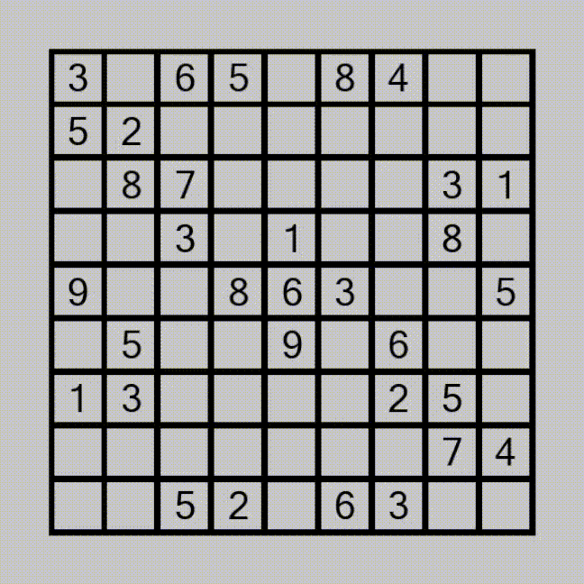 <br/>
Graphical window showing backtracking algorithm <br/>

### Reflection
To decrease the scale of the code, I started by creating a program to solve a 4x4 sudoku. I tried to figure out the solving algorithm on my own, which led to using a very inefficient algorithm in which every possible row would be checked against the constraints given the numbers in the empty puzzle in that row, then all possible rows would be compared to see which combinations had different numbers in each column. In doing this, I learned how to use the numpy library to make arrays since this is faster than Python lists. While this worked for a 4x4 sudoku, it was far too inefficient for a 9x9 due to number of operations increasing by several orders of magnitude, so I found a solving algorithm on [this](http://www.tutorialspoint.com/questions/question.php?qid=Sudoku-Solving-algorithms) website, then translated this logic to Python code. The crucial part of the algorithm that I didn't understand was its use of recursive functions for backtracking. It works by testing a number in each place, starting at the top left, and moving to the right and down if the number it tests works. Here's the interesting backtracking prat: when it reaches a point where no number works, since the function is called inside itself, it goes back a step and tries the next number. This allows it to efficiently try many combinations, gradually finding the only possible numbers until it finds a solution. [Here](https://www.cis.upenn.edu/~matuszek/cit594-2012/Pages/backtracking.html) is a good explanation of how backtracking works. After all of this, I decided to use Pygame to display the solving algorithm graphically, which wasn't particularly hard, just a matter of learning Pygame syntax and structure.
 
## Onshape_CAD_Intro
 
### Assignment Description
In this assignment, I followed the [CAD Intro Onshape tutorial](https://cvilleschools.onshape.com/documents/ce5ac8909ec93f2ab937afda/w/77af2f4715cd6b9dc0f3d968/e/1cf175a4a9e7faeb7db52e25) and created a skateboard with trucks, wheels, and bearings.

### Evidence
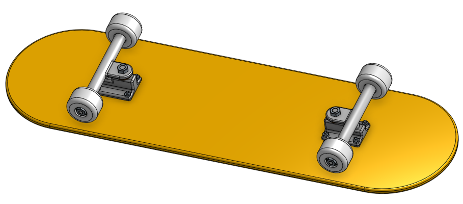 <br/>

### Part Link
[CAD Intro Part](https://cvilleschools.onshape.com/documents/1455c1368501d22d142282f1/w/1e315f3e6a2755c6cbb794c2/e/cf1f6821b95f1639e5be1e12?renderMode=0&uiState=616855bd7b757264a0da7982)

### Reflection
This tutorial wasn't challenging to follow since it is geared towards people without CAD experience, but I still learned a few useful shortcuts. There is a hole tool in part studios that allows you to create holes for standard content (bolts and screws) to go in. Also, when adding standard content in multiple places in an assembly, the replicate tool allows you to add it in all places more easily.

## Onshape_Legos

### Assignment Description
For this assignment, I followed the [Intro to Cad - 3.1-3.4](https://cvilleschools.onshape.com/documents/d2d156bfb1db472973063473/w/2ec44ccdcd6dacf683eb0c6f/e/449d413b724c54cc4db32973) Onshape tutorial and created a lego with many configurations and a couple assemblies with detailed drawings.

### Evidence
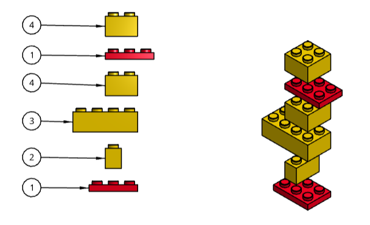 <br/>

### Part Link
[Onshape Lego Part](https://cvilleschools.onshape.com/documents/d4b9e0ac6ea41f5ac0f2d261/w/901fc85d311634cdd81c72a0/e/82f54bcae5a80b14d8d8f5cb)
 
### Reflection
In this tuturial I learned how to use snap mode in assemblies to easily mate two features with well placed mate connectors. I also learned how to make drawings that clearly communicate design of assemblies by using exploded views, bill of materials tables, and callouts.

## Onshape_Multi-Tool

### Assignemnt Description
In this assignment I created a multi-tool with rulers, a protractor, and hex wrench in Onshape, then laser cut it.

### Evidence
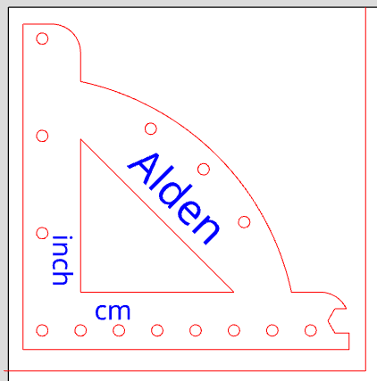 <br/>
 
### Part Link
[Onshape Multi-Tool Part](https://cvilleschools.onshape.com/documents/eab11580c3b34a0e9e279774/w/e12b8caf1de425bace48459f/e/b1e3a10a46bf68d46fa88723)
 
### Reflection
The Onshape part of this assignment was pretty simple, but the lasercutting portion was instructive. I learned how to create a dxf file from the Onshape document and relearned the process of using the laser cutter.
 
## Raspberry_Pi_LED_Blink
 
### Assignment Description
In this assignment I used a Raspberry Pi and Python to blink to LEDs.
 
### Evidence
 
### Wiring
 <br/>
 
### Reflection
This assignment taught me how to use Raspberry Pi GPIO and how to use it from a Python script. I also relearned how to wire a 

## Raspberry_Pi_Shutdown_Button
 
### Assignment Description
In this assignment I made a program run in the background when my Raspberry Pi is on and turn it off or reset it when a button is pressed.
 
### Evidence
 
### Wiring
 <br/>
 
### Reflection
